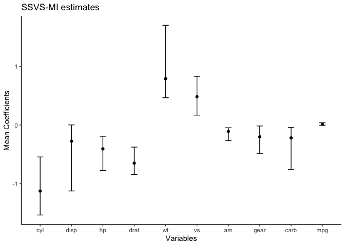
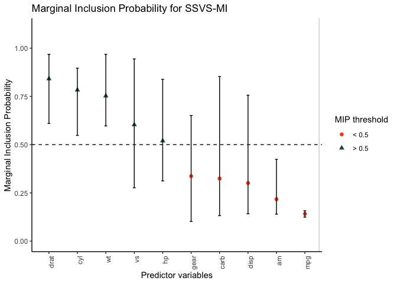

<!-- README.md is generated from README.Rmd. Please edit that file -->

# SSVS 

<!-- badges: start -->

[](https://github.com/sabainter/SSVS/actions)
<!-- badges: end -->

The goal of {SSVS} is to provide functions for performing stochastic
search variable selection (SSVS) for binary and continuous outcomes and
visualizing the results. SSVS is a Bayesian variable selection method
used to estimate the probability that individual predictors should be
included in a regression model. Using MCMC estimation, the method
samples thousands of regression models in order to characterize the
model uncertainty regarding both the predictor set and the regression
parameters.

## Installation

You can install the development version of {SSVS} from
[GitHub](https://github.com/) with:

``` r
# install.packages("remotes")
remotes::install_github("sabainter/SSVS")
```

## Example 1 - continuous response variable

Consider a simple example using SSVS on the `mtcars` dataset to predict
quarter mile times. We first specify our response variable (“qsec”),
then choose our predictors and run the `ssvs()` function.

``` r
library(SSVS)
outcome <- 'qsec'
predictors <- c('cyl', 'disp', 'hp', 'drat', 'wt',
 'vs', 'am', 'gear', 'carb','mpg')

results <- ssvs(data = mtcars, x = predictors, y = outcome, progress = FALSE)
```

The results can be summarized and printed using the `summary()`
function. This will display both the MIP for each predictor, as well as
the probable range of values for each coefficient.

``` r
summary_results <- summary(results, interval = 0.9, ordered = TRUE)
```

| Variable |  MIP   | Avg Beta | Avg Nonzero Beta | Lower CI (90%) | Upper CI (90%) |
|:---------|:------:|:--------:|:----------------:|:--------------:|:--------------:|
| wt       | 0.8433 |  1.0433  |      1.2372      |     0.0000     |     1.9513     |
| vs       | 0.7512 |  0.6399  |      0.8519      |     0.0000     |     1.1982     |
| hp       | 0.5413 | -0.4995  |     -0.9228      |    -1.3349     |     0.0000     |
| cyl      | 0.4551 | -0.5173  |     -1.1367      |    -1.7670     |     0.0005     |
| am       | 0.4240 | -0.3107  |     -0.7328      |    -1.0805     |     0.0000     |
| disp     | 0.4130 | -0.4553  |     -1.1023      |    -1.8170     |     0.0012     |
| carb     | 0.3938 | -0.2890  |     -0.7338      |    -1.0068     |     0.0000     |
| gear     | 0.2013 | -0.0918  |     -0.4560      |    -0.5464     |     0.0002     |
| mpg      | 0.1584 |  0.0563  |      0.3557      |    -0.0001     |     0.4160     |
| drat     | 0.1003 | -0.0180  |     -0.1794      |    -0.0008     |     0.0000     |

The MIPs for each predictor can then be visualized using the `plot()`
function.

``` r
plot(results)
```


## Example 2 - binary response variable

In the example above, the response variable was a continuous variable.
The same workflow can be used for binary variables by specifying
`continuous = FALSE` to the `ssvs()` function.

As an example, let’s create a binary variable:

``` r
library(AER)
data(Affairs)
Affairs$hadaffair[Affairs$affairs > 0] <- 1
Affairs$hadaffair[Affairs$affairs == 0] <- 0
```

Then define the outcome and predictors.

``` r
outcome <- "hadaffair"
predictors <- c("gender", "age", "yearsmarried", "children", "religiousness", "education", "occupation", "rating")
```

And finally run the model:

``` r
results <- ssvs(data = Affairs, x = predictors, y = outcome, continuous = FALSE, progress = FALSE)
```

Now the results can be summarized or visualized in the same manner.

``` r
summary_results <- summary(results, interval = 0.9, ordered = TRUE)
```

| Variable      |  MIP   | Avg Beta | Avg Nonzero Beta | Lower CI (90%) | Upper CI (90%) |
|:--------------|:------:|:--------:|:----------------:|:--------------:|:--------------:|
| rating        | 1.0000 | -0.5548  |     -0.5548      |    -0.7103     |    -0.3943     |
| religiousness | 0.3808 | -0.1258  |     -0.3303      |    -0.3981     |     0.0000     |
| children      | 0.0807 |  0.0226  |      0.2802      |     0.0000     |     0.0000     |
| yearsmarried  | 0.0774 |  0.0235  |      0.3035      |     0.0000     |     0.0000     |
| age           | 0.0081 | -0.0015  |     -0.1840      |     0.0000     |     0.0000     |
| gender        | 0.0071 |  0.0010  |      0.1401      |     0.0000     |     0.0000     |
| occupation    | 0.0059 |  0.0007  |      0.1125      |     0.0000     |     0.0000     |
| education     | 0.0057 |  0.0008  |      0.1352      |     0.0000     |     0.0000     |

``` r
plot(results)
```


## Example 3 - example for SSVS-MI analysis

First, we will show how to use `mice()` function to impute data.

``` r
library(mice)

# Load the mtcars dataset
data <- mtcars

# Introduce random missingness in 10% of the data
set.seed(123)  
n <- nrow(data) * ncol(data)
missing_indices <- sample(n, size = 0.1 * n, replace = FALSE)

# Convert missing indices to row-column positions
rows <- (missing_indices - 1) %% nrow(data) + 1
cols <- (missing_indices - 1) %/% nrow(data) + 1

# Assign NA to the identified positions
for (i in seq_along(rows)) {
  data[rows[i], cols[i]] <- NA
}

# Perform multiple imputation using mice
imputed_data <- mice(data, m = 5, maxit = 50, seed = 123)

# Display the results of the imputation
summary(imputed_data)

# Extract and show the first completed dataset
imputed_mtcars <- complete(imputed_data, "long")
head(imputed_mtcars)
```

We will use this imputed data to do SSVS-MI analysis. We first need to
specify outcome, predictors, and imputations, and then use `SSVS_MI()`
function.

``` r
outcome <- 'qsec'
predictors <- c('cyl', 'disp', 'hp', 'drat', 'wt', 'vs', 'am', 'gear', 'carb','mpg')
imputation <- '.imp'
results <- ssvs_mi(data = imputed_mtcars, y = outcome, x = predictors, imp = imputation)
```

The estimates of SSVS_MI result can be summarized by using
`summary.mi()` function. This will display average, minimum, and maximum
of estimates, MIP and average nonzero beta for each coefficient.

``` r
summary_MI <- summary.mi(results)
print(summary_MI)
#>  Variable Avg Beta Min Beta Max Beta Avg MIP Min MIP Max MIP Avg Nonzero Beta
#>  cyl      -1.12494 -1.5338  -0.5440  0.78332 0.5482  0.8965  -1.40290        
#>  disp     -0.27532 -1.1233   0.0031  0.30064 0.1413  0.7565  -0.54504        
#>  hp       -0.40554 -0.7750  -0.1912  0.51962 0.3120  0.8385  -0.74010        
#>  drat     -0.64942 -0.8412  -0.3755  0.84148 0.6100  0.9683  -0.75698        
#>  wt        0.79026  0.4665   1.7013  0.75254 0.5971  0.9681   0.99290        
#>  vs        0.48298  0.1695   0.8313  0.60334 0.2762  0.9443   0.76662        
#>  am       -0.10768 -0.2667  -0.0461  0.21718 0.1397  0.4239  -0.44058        
#>  gear     -0.20026 -0.4883  -0.0150  0.33668 0.1015  0.6510  -0.44048        
#>  carb     -0.21882 -0.7588  -0.0425  0.32414 0.1319  0.8530  -0.50014        
#>  mpg       0.01382 -0.0034   0.0393  0.14114 0.1241  0.1573   0.09624        
#>  Min Nonzero Beta Max Nonzero Beta
#>  -1.7778          -0.9923         
#>  -1.4850           0.0222         
#>  -0.9243          -0.6130         
#>  -0.8687          -0.6156         
#>   0.7124           1.7573         
#>   0.6136           0.8803         
#>  -0.6290          -0.3302         
#>  -0.7500          -0.1473         
#>  -0.8895          -0.3222         
#>  -0.0236           0.2724
```

The estimates for each predictor can then be visualized using the
`plot.est()` function.

``` r
plot.est(summary_MI)
```



The MIP for each predictor can then be visualized using the `plot.mip()`
function.

``` r
plot.mip(summary_MI)
```



## Interactive version

You can launch an interactive (shiny) web application that lets you run
SSVS analyses without programming. Simply install this package and run
`SSVS::launch()` in an R console.
