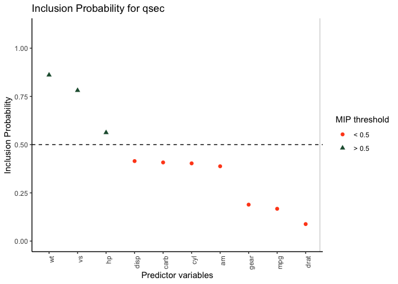
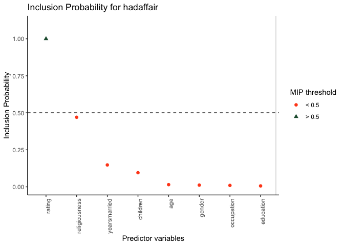

<!-- README.md is generated from README.Rmd. Please edit that file -->

# SSVS 

<!-- badges: start -->

[](https://github.com/sabainter/SSVS/actions)
[](https://github.com/sabainter/SSVS/actions/workflows/R-CMD-check.yaml)
<!-- badges: end -->

The goal of {SSVS} is to provide functions for performing stochastic
search variable selection (SSVS) for binary and continuous outcomes and
visualizing the results. SSVS is a Bayesian variable selection method
used to estimate the probability that individual predictors should be
included in a regression model. Using MCMC estimation, the method
samples thousands of regression models in order to characterize the
model uncertainty regarding both the predictor set and the regression
parameters.

## Installation

You can install the development version of {SSVS} from
[GitHub](https://github.com/) with:

``` r
# install.packages("remotes")
remotes::install_github("sabainter/SSVS")
```

## Example 1 - continuous response variable

Consider a simple example using SSVS on the `mtcars` dataset to predict
quarter mile times. We first specify our response variable (“qsec”),
then choose our predictors and run the `ssvs()` function.

``` r
library(SSVS)
outcome <- 'qsec'
predictors <- c('cyl', 'disp', 'hp', 'drat', 'wt',
 'vs', 'am', 'gear', 'carb','mpg')

results <- ssvs(data = mtcars, x = predictors, y = outcome, prior.probs = .5, progress = FALSE)
```

The results can be summarized and printed using the `summary()`
function. This will display the MIP for each predictor, the average
coefficients including and excluding zeros, and credible intervals for
each coefficient.

``` r
summary_results <- summary(results, interval = 0.9, ordered = TRUE)
```

| Variable |  MIP   | Avg Beta | Avg Nonzero Beta | Lower CI (90%) | Upper CI (90%) |
|:---------|:------:|:--------:|:----------------:|:--------------:|:--------------:|
| wt       | 0.8610 |  1.0867  |      1.2621      |     0.0000     |     1.9848     |
| vs       | 0.7811 |  0.6758  |      0.8652      |     0.0000     |     1.2105     |
| hp       | 0.5624 | -0.5301  |     -0.9425      |    -1.3503     |     0.0000     |
| disp     | 0.4148 | -0.4669  |     -1.1257      |    -1.8466     |     0.0013     |
| carb     | 0.4077 | -0.3031  |     -0.7435      |    -1.0244     |     0.0000     |
| cyl      | 0.4030 | -0.4390  |     -1.0894      |    -1.7133     |     0.0000     |
| am       | 0.3878 | -0.2710  |     -0.6988      |    -1.0090     |     0.0000     |
| gear     | 0.1889 | -0.0804  |     -0.4256      |    -0.4925     |     0.0000     |
| mpg      | 0.1675 |  0.0623  |      0.3721      |     0.0000     |     0.4615     |
| drat     | 0.0881 | -0.0134  |     -0.1523      |     0.0000     |     0.0000     |

The MIPs for each predictor can then be visualized using the `plot()`
function.

``` r
plot(results)
```



## Example 2 - binary response variable

In the example above, the response variable was a continuous variable.
The same workflow can be used for binary variables by specifying
`continuous = FALSE` to the `ssvs()` function.

As an example, let’s create a binary variable:

``` r
library(AER)
#> Warning: package 'AER' was built under R version 4.5.2
data(Affairs)
Affairs$hadaffair[Affairs$affairs > 0] <- 1
Affairs$hadaffair[Affairs$affairs == 0] <- 0
```

Then define the outcome and predictors.

``` r
outcome <- "hadaffair"
predictors <- c("gender", "age", "yearsmarried", "children", "religiousness", "education", "occupation", "rating")
```

And finally run the model:

``` r
results <- ssvs(data = Affairs, x = predictors, y = outcome, continuous = FALSE, progress = FALSE)
```

Now the results can be summarized or visualized in the same manner.

``` r
summary_results <- summary(results, interval = 0.9, ordered = TRUE)
```

| Variable      |  MIP   | Avg Beta | Avg Nonzero Beta | Lower CI (90%) | Upper CI (90%) |
|:--------------|:------:|:--------:|:----------------:|:--------------:|:--------------:|
| rating        | 1.0000 | -0.5549  |     -0.5549      |    -0.7257     |    -0.3996     |
| religiousness | 0.5337 | -0.1817  |     -0.3405      |    -0.4362     |     0.0000     |
| yearsmarried  | 0.1589 |  0.0502  |      0.3157      |     0.0000     |     0.2760     |
| children      | 0.1207 |  0.0344  |      0.2853      |     0.0000     |     0.1805     |
| gender        | 0.0128 |  0.0015  |      0.1177      |     0.0000     |     0.0000     |
| age           | 0.0111 | -0.0021  |     -0.1925      |     0.0000     |     0.0000     |
| education     | 0.0082 |  0.0009  |      0.1108      |     0.0000     |     0.0000     |
| occupation    | 0.0077 |  0.0009  |      0.1152      |     0.0000     |     0.0000     |

``` r
plot(results)
```



## Example 3 - SSVS with multiple imputation (MI)

First, we will use the `mice()` function from the {mice} package to
perform multiple imputation.

``` r
library(mice)
#> 
#> Attaching package: 'mice'
#> The following object is masked from 'package:stats':
#> 
#>     filter
#> The following objects are masked from 'package:base':
#> 
#>     cbind, rbind

# Load the mtcars dataset
data <- mtcars

# Introduce random missingness in 10% of the data
set.seed(123)  
n <- nrow(data) * ncol(data)
missing_indices <- sample(n, size = 0.1 * n, replace = FALSE)

# Convert missing indices to row-column positions
rows <- (missing_indices - 1) %% nrow(data) + 1
cols <- (missing_indices - 1) %/% nrow(data) + 1

# Assign NA to the identified positions
for (i in seq_along(rows)) {
  data[rows[i], cols[i]] <- NA
}

# Perform multiple imputation using mice
imputed_data <- mice(data, m = 5, maxit = 50, seed = 123)

# Display the results of the imputation
summary(imputed_data)

# Extract and show the first completed dataset
imputed_mtcars <- complete(imputed_data, "long")
head(imputed_mtcars)
```

We will use this multiply imputed data set for SSVS, using the
`ssvs_mi()` function.

``` r
outcome <- 'qsec'
predictors <- c('cyl', 'disp', 'hp', 'drat', 'wt', 'vs', 'am', 'gear', 'carb','mpg')
imputation <- '.imp'
results <- ssvs_mi(data = imputed_mtcars, y = outcome, x = predictors, imp = imputation)
```

The results of SSVS with MI can be summarized with the `summary()` and
`plot()` functions. This will summarize *across imputations* for each
predictor: the average MIP and the mean, minimum, maximum, and average
nonzero beta coefficients.

## Interactive version

You can launch an interactive (shiny) web application that lets you run
SSVS analyses without programming. Simply install this package and run
`SSVS::launch()` in an R console.
