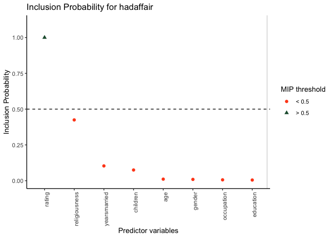

<!-- README.md is generated from README.Rmd. Please edit that file -->

# SSVS 

<!-- badges: start -->

[](https://github.com/sabainter/SSVS/actions)
<!-- badges: end -->

The goal of {SSVS} is to provide functions for performing stochastic
search variable selection (SSVS) for binary and continuous outcomes and
visualizing the results. SSVS is a Bayesian variable selection method
used to estimate the probability that individual predictors should be
included in a regression model. Using MCMC estimation, the method
samples thousands of regression models in order to characterize the
model uncertainty regarding both the predictor set and the regression
parameters.

## Installation

You can install the development version of {SSVS} from
[GitHub](https://github.com/) with:

``` r
# install.packages("remotes")
remotes::install_github("sabainter/SSVS")
```

## Example 1 - continuous response variable

Consider a simple example using SSVS on the `mtcars` dataset to predict
quarter mile times. We first specify our response variable (“qsec”),
then choose our predictors and run the `ssvs()` function.

``` r
library(SSVS)
outcome <- 'qsec'
predictors <- c('cyl', 'disp', 'hp', 'drat', 'wt',
 'vs', 'am', 'gear', 'carb','mpg')

results <- ssvs(data = mtcars, x = predictors, y = outcome, progress = FALSE)
```

The results can be summarized and printed using the `summary()`
function. This will display both the MIP for each predictor, as well as
the probable range of values for each coefficient.

``` r
summary_results <- summary(results, interval = 0.9, ordered = TRUE)
```

| Variable |  MIP   | Avg Beta | Lower CI (90%) | Upper CI (90%) | Avg Nonzero Beta |
|:---------|:------:|:--------:|:--------------:|:--------------:|:----------------:|
| wt       | 0.8433 |  1.0433  |     0.0000     |     1.9513     |      1.2372      |
| vs       | 0.7512 |  0.6399  |     0.0000     |     1.1982     |      0.8519      |
| hp       | 0.5413 | -0.4995  |    -1.3349     |     0.0000     |     -0.9228      |
| cyl      | 0.4551 | -0.5173  |    -1.7670     |     0.0005     |     -1.1367      |
| am       | 0.4240 | -0.3107  |    -1.0805     |     0.0000     |     -0.7328      |
| disp     | 0.4130 | -0.4553  |    -1.8170     |     0.0012     |     -1.1023      |
| carb     | 0.3938 | -0.2890  |    -1.0068     |     0.0000     |     -0.7338      |
| gear     | 0.2013 | -0.0918  |    -0.5464     |     0.0002     |     -0.4560      |
| mpg      | 0.1584 |  0.0563  |    -0.0001     |     0.4160     |      0.3557      |
| drat     | 0.1003 | -0.0180  |    -0.0008     |     0.0000     |     -0.1794      |

The MIPs for each predictor can then be visualized using the `plot()`
function.

``` r
plot(results)
```


## Example 2 - binary response variable

In the example above, the response variable was a continuous variable.
The same workflow can be used for binary variables by specifying
`continuous = FALSE` to the `ssvs()` function.

As an example, let’s create a binary variable:

``` r
library(AER)
data(Affairs)
Affairs$hadaffair[Affairs$affairs > 0] <- 1
Affairs$hadaffair[Affairs$affairs == 0] <- 0
```

Then define the outcome and predictors.

``` r
outcome <- "hadaffair"
predictors <- c("gender", "age", "yearsmarried", "children", "religiousness", "education", "occupation", "rating")
```

And finally run the model:

``` r
results <- ssvs(data = Affairs, x = predictors, y = outcome, continuous = FALSE, progress = FALSE)
```

Now the results can be summarized or visualized in the same manner.

``` r
summary_results <- summary(results, interval = 0.9, ordered = TRUE)
```

| Variable      |  MIP   | Avg Beta | Lower CI (90%) | Upper CI (90%) | Avg Nonzero Beta |
|:--------------|:------:|:--------:|:--------------:|:--------------:|:----------------:|
| rating        | 0.9993 | -0.5553  |    -0.7173     |    -0.4027     |     -0.5557      |
| religiousness | 0.4024 | -0.1332  |    -0.4032     |     0.0000     |     -0.3309      |
| children      | 0.0955 |  0.0268  |     0.0000     |     0.0000     |      0.2804      |
| yearsmarried  | 0.0899 |  0.0272  |     0.0000     |     0.0000     |      0.3020      |
| gender        | 0.0075 |  0.0008  |     0.0000     |     0.0000     |      0.1092      |
| occupation    | 0.0063 |  0.0006  |     0.0000     |     0.0000     |      0.0986      |
| age           | 0.0058 | -0.0007  |     0.0000     |     0.0000     |     -0.1202      |
| education     | 0.0041 |  0.0004  |     0.0000     |     0.0000     |      0.1011      |

``` r
plot(results)
```



## Interactive version

You can launch an interactive (shiny) web application that lets you run
SSVS analyses without programming. Simply install this package and run
`SSVS::launch()` in an R console.
